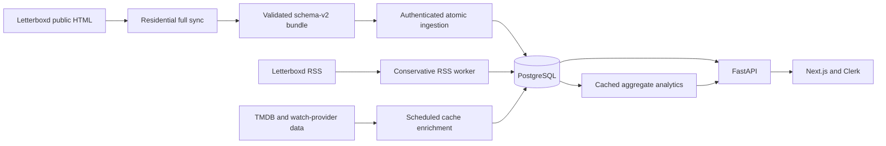

# Spyboxd

**Live product: [spyboxd.com](https://spyboxd.com)**

Spyboxd turns public Letterboxd histories into group analytics, taste comparisons, co-watch signals, and practical movie recommendations. The public homepage shows an identity-free view of the collection; the signed-in workspace lets each account monitor its own set of profiles.

[Open Spyboxd](https://spyboxd.com) · [Sign in](https://spyboxd.com/sign-in) · [Create an account](https://spyboxd.com/sign-up)

## Product

| Surface | What it provides |
| --- | --- |
| Public dashboard | Aggregate profile, film, review, rating, activity, signal, freshness, and coverage metrics without exposing profile identities. |
| My Dashboard | A private overview of the profiles an account monitors, including group activity, rating patterns, recent changes, and Spy Signals. |
| Spy Signals | Same-film watches on the same day or within a selected gap, group co-watch patterns, and occurrence-aware Rewatch Echoes. |
| Compare | Pair Dossier, Taste DNA, Taste Through Time, and Signal Calendar views for two selected profiles. |
| Watch Together | Ranked group picks from unseen films, watchlist overlap, collective blind spots, or an imported public list. Results can be filtered by runtime, genre, offer type, and availability country. |
| Analysis | Single-profile rating distributions, diary activity, recent watches, ratings, reviews, and data limitations when an import has known gaps. |
| My Profiles | Private monitoring choices over the shared profile catalog, plus requests for profiles that still need a full import. |

New accounts use their exact Letterboxd username as their Spyboxd handle and primary profile. If that profile is already imported, Spyboxd links it immediately; otherwise it creates a pending request for the next residential full sync.

## Data architecture

Spyboxd separates complete profile collection from production serving. The production server does not perform full Letterboxd HTML scraping.

- A residential runner captures complete public profile surfaces and produces a manifest-backed bundle only when the requested datasets and recorded counts are internally consistent.
- The API validates each bundle, resolves canonical movies, and commits profile state, watch occurrences, lists, watchlists, reviews, compatibility tables, and sync lineage in one transaction.
- PostgreSQL stores each imported profile and canonical movie once. Per-user access is represented separately through account-to-profile mappings rather than duplicated profile data.
- The RSS worker observes recent public diary and review additions between full syncs. RSS is never treated as complete history and never deletes data.
- TMDB enrichment is independent of Letterboxd ingestion. It adds cached metadata and country-specific streaming, rental, and purchase availability when present.
- Expensive global dashboard analytics are cached after data-changing operations; ordinary account dashboards are calculated only over that account's monitored profiles.

## Privacy and access

- `/` and the public dashboard API expose a strict aggregate allowlist. They do not return usernames, profile pairs, film titles, watch dates, or profile-level activity.
- Profile snapshots, lists, activity, analytics, requests, and management tools require a Clerk-authenticated session.
- Ordinary accounts can access only profiles they monitor. Their monitoring choices and profile requests are private to that account.
- Administrative mutations require a trusted boolean admin claim or a server-side Clerk user-ID allowlist; ingestion uses a separate upload token.
- Clerk's stable user ID remains the authorization key. The signed Letterboxd username claim supplies the account's display handle and primary-profile link.

## Data integrity

Spyboxd is deliberately explicit about what its sources can and cannot establish.

- Full residential snapshots are the reconciliation source for public profile state. RSS is an additions-only freshness layer and cannot prove deletions or complete watch, list, favorite, or watchlist history.
- Repeat diary entries are stored as individual watch events instead of being collapsed into one film-level date.
- Missing or private Letterboxd fields are reported through coverage metadata rather than inferred.
- Timing views describe temporal association and follow patterns, not influence or causality.
- Availability country means the country where streaming, rental, or purchase offers are checked; `Worldwide` means any supported country, not a film's origin or language.
- Linking a Letterboxd username connects its public profile data; it is not independent proof that the registrant owns that Letterboxd account.

## Production

Spyboxd runs as three hardened systemd services behind Nginx and TLS:

- a Next.js frontend on a loopback-only port;
- a FastAPI application backed by PostgreSQL;
- an independent Letterboxd RSS worker.

Production releases are built and tested by GitHub Actions, packaged as an exact-revision artifact, and deployed into versioned release directories. The pipeline audits locked dependencies, migrates and tests PostgreSQL, checks model/migration parity, lints and builds the frontend, runs Playwright smoke coverage, and validates deployment assets. Alembic migrations run before atomic activation; local and public readiness checks must report the expected revision, and an unhealthy activation restores a compatible retained release without downgrading the database.

Nginx terminates TLS, rate-limits the public API and upload path, and proxies only to loopback services. UFW keeps application ports private. Runtime services use a dedicated unprivileged account and restrictive systemd sandboxing. TMDB cache enrichment runs as a separate bounded production workflow.

## Technology

- **Frontend:** Next.js App Router, React, TanStack Query, Clerk, Tailwind CSS, Framer Motion, Chart.js
- **Backend:** FastAPI, SQLAlchemy, Alembic, Pydantic
- **Data:** PostgreSQL, normalized movie/profile state, occurrence-level watch events, cached analytics
- **Ingestion:** Python residential scraper, validated ZIP imports, incremental RSS observation, TMDB enrichment
- **Operations:** Nginx, systemd, GitHub Actions, exact-SHA releases, guarded rollback

## Repository map

- [`frontend/`](frontend/) — public dashboard and authenticated analytics workspace
- [`backend/`](backend/) — API, authorization, ingestion, analytics, RSS, and enrichment services
- [`alembic/`](alembic/) — additive PostgreSQL schema migrations
- [`scripts/`](scripts/) — residential full-sync, archive import, batch sync, and enrichment entry points
- [`deploy/`](deploy/) — production Nginx, systemd, release, health, and rollback assets
- [`.github/workflows/`](.github/workflows/) — CI, production deployment, rollback, and scheduled enrichment
- [`DATABASE.md`](DATABASE.md) — normalized schema, lineage, compatibility tables, and integrity rules

## Data sources and attribution

Spyboxd is an independent project and is not affiliated with Letterboxd. It works from imported public Letterboxd data. This product uses the TMDB API but is not endorsed or certified by TMDB. Watch-provider availability is supplied through TMDB's JustWatch-powered provider data.
