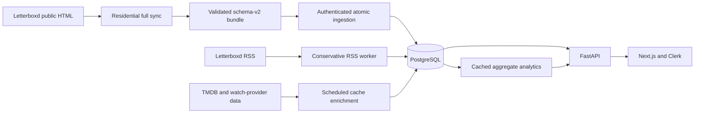

# Spyboxd

[](https://github.com/Yash03x/spyboxd/actions/workflows/ci.yml)

**Website: [spyboxd.com](https://spyboxd.com)**

Spyboxd turns public Letterboxd histories into group analytics, taste comparisons, co-watch signals, and practical movie recommendations. The public homepage shows an identity-free view of the collection; the signed-in workspace lets each account monitor its own set of profiles.

[Open Spyboxd](https://spyboxd.com) · [Sign in](https://spyboxd.com/sign-in) · [Create an account](https://spyboxd.com/sign-up)

## Product

| Surface | What it provides |
| --- | --- |
| Public dashboard | Aggregate profile, film, review, rating, activity, signal, freshness, and coverage metrics without exposing profile identities. |
| My Dashboard | A private overview of the profiles an account monitors, including group activity, rating patterns, recent changes, and Spy Signals. |
| Spy Signals | Same-film watches on the same day or within a selected gap, group co-watch patterns, and occurrence-aware Rewatch Echoes. |
| Compare | Pair Dossier, Taste DNA, Taste Through Time, and Signal Calendar views for two selected profiles. |
| Watch Together | Ranked group picks from unseen films, watchlist overlap, collective blind spots, or an imported public list. Results can be filtered by runtime, genre, offer type, and availability country. |
| Analysis | Single-profile rating distributions, diary activity, recent watches, ratings, reviews, and data limitations when an import has known gaps. |
| My Profiles | Private monitoring choices over the shared profile catalog, plus requests for profiles that still need a full import. |

New accounts use their exact Letterboxd username as their Spyboxd handle and primary profile. If that profile is already imported, Spyboxd links it immediately; otherwise it creates a pending request for the next residential full sync.

The signed-in workspace has labelled **Overview, Overlaps, People, Tonight, Films, and Data** navigation. The searchable insight guide carries the selected group between sections, and the long individual and pair pages have a searchable panel index. Profile selection also supports username search for larger libraries.

- **Films → Group Trends** compares yearly watch activity, each member's contribution, and up to 50 taste traits ordered by viewing volume or alignment, with watched and rated sample sizes. Undated history, year-to-date periods, pooled ratings, and trait limits are stated alongside the results.
- **Tonight → Picks** combines runtime, genre, country, offer type, and rewatch preferences in shareable URLs. The default watchlist-based ranking gives every selected person equal influence and shows its score breakdown; unknown ratings are neutral, not positive evidence. It is a ranking heuristic, not a prediction of everyone's taste.
- **Tonight → Where to Watch** reads cached country offers, including Worldwide, and separates missing or stale provider checks from a confirmed lack of offers. Movie-detail refresh timestamps never stand in for provider refresh timestamps.

## Data architecture

Spyboxd separates complete profile collection from production serving. The production server does not perform full Letterboxd HTML scraping.


```mermaid
flowchart LR
    L["Letterboxd public HTML"] --> R["Residential full sync"]
    R --> B["Validated schema-v2 bundle"]
    B --> I["Authenticated atomic ingestion"]

    F["Letterboxd RSS"] --> W["Conservative RSS worker"]
    T["TMDB and watch-provider data"] --> E["Scheduled cache enrichment"]

    I --> P[(PostgreSQL)]
    W --> P
    E --> P
    P --> C["Cached aggregate analytics"]
    P --> A["FastAPI"]
    C --> A
    A --> N["Next.js and Clerk"]
```

- A residential runner captures complete public profile surfaces and produces a manifest-backed bundle only when the requested datasets and recorded counts are internally consistent.
- The API validates each bundle, resolves canonical movies, and commits profile state, watch occurrences, lists, watchlists, reviews, compatibility tables, and sync lineage in one transaction.
- PostgreSQL stores each imported profile and canonical movie once. Per-user access is represented separately through account-to-profile mappings rather than duplicated profile data.
- The RSS worker observes recent public diary and review additions between full syncs. RSS is never treated as complete history and never deletes data.
- TMDB enrichment is independent of Letterboxd ingestion. It adds cached metadata and country-specific streaming, rental, and purchase availability when present.
- Expensive global dashboard analytics are cached after data-changing operations; ordinary account dashboards are calculated only over that account's monitored profiles.

## Privacy and access

- `/` and the public dashboard API expose a strict aggregate allowlist. They do not return usernames, profile pairs, film titles, watch dates, or profile-level activity.
- Profile snapshots, lists, activity, analytics, requests, and management tools require a Clerk-authenticated session.
- Ordinary accounts can access only profiles they monitor. Their monitoring choices and profile requests are private to that account.
- Administrative mutations require a trusted boolean admin claim or a server-side Clerk user-ID allowlist; ingestion uses a separate upload token.
- Clerk's stable user ID remains the authorization key. The signed Letterboxd username claim supplies the account's display handle and primary-profile link.

## Data integrity

Spyboxd is deliberately explicit about what its sources can and cannot establish.

- Full residential snapshots are the reconciliation source for public profile state. RSS is an additions-only freshness layer and cannot prove deletions or complete watch, list, favorite, or watchlist history.
- Repeat diary entries are stored as individual watch events instead of being collapsed into one film-level date.
- Missing or private Letterboxd fields are reported through coverage metadata rather than inferred.
- Timing views describe temporal association and follow patterns, not influence or causality.
- Availability country means the country where streaming, rental, or purchase offers are checked; `Worldwide` means any supported country, not a film's origin or language.
- Linking a Letterboxd username connects its public profile data; it is not independent proof that the registrant owns that Letterboxd account.

## Run on localhost

Use Node.js 24, Python 3.12 or 3.13, and a running local PostgreSQL instance. Docker, Redis, Cloudflare, and Hetzner are not required for this setup.

For a new checkout, create a virtual environment and install the locked backend dependencies with `.venv/bin/python -m pip install --require-hashes -r requirements.lock`; install frontend dependencies with `npm ci` from `frontend/`. Copy the example environment files to the ignored `.env` and `frontend/.env.local` only if those files do not already exist. Keep existing credentials and database contents.

The backend's `DATABASE_URL` should point to the local `spyboxd` database. Use matching Clerk development-instance settings in both environment files, with `http://localhost:3000` as the authorized frontend origin. Keep frontend `API_URL` and `NEXT_PUBLIC_API_BASE_URL`, and the residential uploader's `SPYBOXD_API_BASE_URL`, set to `http://localhost:8000`.

Run each service in a separate terminal. Start the API from the repository root:

```sh
PYTHONPATH=backend .venv/bin/python -m uvicorn main:app --app-dir backend --host 127.0.0.1 --port 8000
```

Start the frontend from `frontend/`, using Node.js 24:

```sh
npm run dev -- --hostname localhost --port 3000
```

Open [http://localhost:3000](http://localhost:3000). The API readiness endpoint at [http://localhost:8000/ready](http://localhost:8000/ready) must report `ready`, with database `ok` and schema `current`. If migrations are required, back up an existing database before running `PYTHONPATH=backend .venv/bin/python -m alembic upgrade head` from the repository root. Do not create or replace an existing database as a troubleshooting shortcut.

Optionally start recent-activity updates from the repository root:

```sh
PYTHONPATH=backend .venv/bin/python -m rss_worker
```

RSS adds recent observations; it does not refresh complete history or replace a residential full sync. These commands bind the web services to loopback only and remain running while their terminals are open. Stop them with Ctrl+C. This setup does not publish the app or start it automatically after a reboot.

### Persistent localhost on macOS

After building the frontend, install the API, web and RSS worker as **user-level
LaunchAgents** (no root access or public port exposure):

```sh
.venv/bin/python scripts/local_services.py install --node /absolute/path/to/node24
.venv/bin/python scripts/local_services.py status
.venv/bin/python scripts/local_services.py restart --only api
```

The installer copies Node 24 into a stable private runtime directory, writes
credential-free plists to `~/Library/LaunchAgents`, and logs to
`~/Library/Logs/Spyboxd`. Secrets continue to come from ignored application env
files. PostgreSQL must already be running (for example via Homebrew services).
The frontend must use the hostname **localhost**, matching the browser and
Clerk; changing only the Next listener hostname to 127.0.0.1 can cause Clerk's
absolute middleware rewrite to proxy back into the same app.

These services restart after exit and start at user login. They cannot serve
while the Mac is asleep, shut down or logged out. `stop` unloads them until the
next login or restart; `uninstall` unloads and renames the exact managed plists
to `.disabled` files, retaining logs/runtime/data. Reinstallation backs up prior
plists. Do not run a second manually launched server on ports 3000/8000.

RSS polls due profiles every ten minutes, respecting retry/backoff and database
leases. `/health/rss` reports polling health independently of `/ready`.
RSS only adds/upserts recent feed observations; watchlists, follows, list
membership, deletions and full-history reconciliation still require a full sync.
No-overlap feeds are flagged for a full load rather than silently considered
complete. Network/provider failures retain the previous snapshots.

Refresh all configured profiles from the repository root with `PYTHONPATH=backend .venv/bin/python scripts/batch_full_sync.py --config scripts/sync-profiles.json`. Verify the manifest's API URL points to localhost before uploading. If upstream liked-review/list pages or tag pages are blocked, the explicit `--skip-liked-content` and `--skip-tags` options preserve their previously imported data and record that those surfaces were not refreshed. Without those options, incomplete crawls still fail before upload. Skipping tags omits tag columns rather than importing empty tags.

## Research and your workspace

Films → **Research** compares a chosen date range with the immediately preceding,
equal-length period. Select an optional second group to compare like-for-like
filters. Member-normalised rates distinguish group size from recorded activity;
individual contributions, trait samples and exact watch-event rows remain visible.
Title/profile search, trait filters and sorting apply to the summaries and CSV
export together. Exports include every matching row, not only the visible page,
and neutralise spreadsheet-formula prefixes in imported text.

Undated watches are excluded from period statistics and counted as coverage gaps.
Unknown ratings are not zero, overlapping groups are not independent samples, and
trait counts can overlap. Log-date mode explicitly falls back to watch date.
These are descriptive observations, not causal findings or population estimates.

Use **Saved groups** in Films, Tonight or Overlaps, **Pin** on Overview/People
statistics, and **Customise your overview** to choose your panels. **Your workspace**
collects the shortcuts and removal controls. Preferences are versioned, stored
only in this browser and separated by signed-in account; they are not a cloud
backup, and opening a saved link never grants access to otherwise unavailable data.

Tonight → Picks → **Test the rating component against held-out ratings** hides
one member's ratings, ranks using the others, and compares their hidden ratings
with a mean-rating-only baseline. It reports each member's sample and result;
it does not establish future satisfaction or test the full watchlist/availability
recommendation pipeline.

Run `PYTHONPATH=backend .venv/bin/python scripts/audit_data_quality.py` for a
read-only audit of the configured database. It distinguishes broken invariants
from missing dates, metadata and unavailable import surfaces. A recent RSS read
does not establish full-history freshness. Refresh source data only through the
supported full-sync/export and opt-in metadata jobs; preserve blocked snapshots.

For release checks, run backend tests against a **separate disposable database**
using `SPYBOXD_TEST_DATABASE_URL`; never point that variable at the live database.
`SPYBOXD_PREVIOUS_APP_REVISION` accepts a verified full ancestor commit for schema
compatibility checks. In `frontend/`, run `npm run test:unit`, `npm run lint`,
`npm run typecheck`, and `CI=1 npm run test:e2e`. Direct CI-style test runs use an
isolated `.next-e2e` build on port 3100, so fixture authentication cannot overwrite
the `.next` build serving localhost:3000. To reuse that local fixture build, pass
both `PLAYWRIGHT_REUSE_BUILD=1` and `SPYBOXD_E2E_BUILD=1`.

## Private MyAnimeList workspace

The **Anime** section (`/anime`) runs alongside the Letterboxd sections. Upload
an official MAL anime `.xml` or `.xml.gz` export using **Import MAL export**.
It provides list/status totals, 1–10 rating distributions, format comparisons,
top-rated completions, the unfinished queue, recorded timelines, and a searchable,
sortable, paginated library with all-matches CSV export. Filters, tabs and saved
snapshot views are URL-backed; Anime panels can be pinned in Your workspace.

Exports are stored in `personal_anime_imports`, scoped to the authenticated
`app_users` owner. There is **no global-admin read override**, no automatic
Letterboxd-profile association, and no MAL network request or API key requirement.
Nothing is bundled into the frontend or copied into the repository. A valid new
export adds an immutable snapshot; identical decompressed XML is idempotent, and
the last 20 snapshots are browseable in **My Library → Source & Data Quality**.
Older duplicates do not replace a newer snapshot. A workspace is bound to the
first imported MAL account ID. Existing film data is untouched.

The importer bounds compressed uploads to 4 MiB, decompressed XML to 12 MiB and
20,000 entries. It rejects DTD/entities, malformed or duplicate IDs, unsupported
statuses, invalid numeric values and mismatched header counts before writing.
Zero scores are unscored; zero episode totals are unknown. Partial/invalid dates
remain inspectable but never become guessed dates. Progress inconsistencies are
flagged without clamping source values. Future-date checks use the browser's IANA
time zone (UTC for API callers that omit it).

This is immutable snapshot analysis with optional **read-only MAL sync**. Import time is not the
export generation time. One row is a MAL title, not a franchise or episode event.
Timelines exclude missing finish dates; elapsed start-to-finish days are not
viewing hours or binge speed. The XML has no genres, studios, runtimes or community
ratings. Comments/tags/private notes are not imported. Tests use synthetic exports,
never a committed personal dataset.

**My Taste** adds genre/studio rankings, personal-vs-community score differences
and explicitly estimated runtime coverage. **My Next Watch** ranks unstarted
plan-to-watch entries using the owner's scored watched history. It shows sample
sizes and shrunk genre/studio contributions, not predicted ratings or
probabilities. Genre/studio drilldowns preserve the exact watched-title scope;
library CSV exports include metadata provenance. Filters and recommendation
time/format controls survive reloads and can be pinned.
Confirmed unreleased or cancelled titles are excluded from next-watch picks;
unknown release status is not treated as proof of availability.

Public metadata is a separate cache, never a modification of an imported
snapshot. Backfill/resume it with:

```sh
.venv/bin/python scripts/enrich_anime.py --limit 2000
```

Only public numeric MAL title IDs are sent to AniList's public catalogue API.
No username, scores, progress, dates or XML are sent. Batches are limited to 40
IDs and spaced at least 3.1 seconds apart, below its temporarily reduced rate
limit. The job stops on provider errors, persists completed batches, excludes
ambiguous MAL-ID mappings, and retains prior good metadata. A database advisory
lock prevents concurrent backfills. Cache age is seven days; unavailable titles
stay visibly missing. This metadata job does **not** refresh the personal list.
Fill missing exact-ID matches from the official MAL API with
`.venv/bin/python scripts/enrich_anime.py --provider mal --missing-only --force`.
It requires `MAL_CLIENT_ID`, sends only public title IDs, and retains existing known metadata.
Community scores retain their provider identity: AniList's 100-point average is
divided by ten; official MAL averages already use 1–10. Runtime estimates multiply recorded episode progress by
provider episode duration, exclude inconsistent progress, and do not infer
rewatches, playback speed, or missing episodes.

**My Changes** compares any two of the latest 20 private snapshots: additions,
removals, scores, progress, statuses, and dates, with before/after evidence,
filters, complete matching CSV export, and links to each historical entry.
These differences are not a watch diary. Episode balance includes corrections
and removals, not just viewing. Unknown fields are not guessed.

For automatic public-list updates, create an application at
[MAL API settings](https://myanimelist.net/apiconfig) and put only `MAL_CLIENT_ID`
in the ignored root `.env`. No client secret or user password is needed.
Import an XML export first to select the account, then enable **MAL synchronization**
in the private Anime section. The `anime` LaunchAgent checks enabled accounts
every six hours while the Mac is awake and online. Manual checks have a ten-minute
cooldown. After changing the environment, restart the API and anime worker.
`.venv/bin/python scripts/local_services.py install --only anime` installs the worker;
`status --only anime` checks it. A private/missing list, invalid page, duplicate ID,
interrupted pagination, or provider error preserves the last good snapshot.
Concurrent imports win over an in-flight sync; pausing revokes that sync's lease.
No-change checks advance last-success time without creating duplicate snapshots.
MAL list sync does not update Letterboxd sources. XML-only priority and raw
times-watched fields are unknown in API snapshots, not copied as fresh facts.

Apply additive migrations through `20261003_0023` with the normal backup-first Alembic
workflow before starting the updated API. Targeted checks are
`pytest backend/tests/test_anime_export.py`, `npm run test:unit`, and
`CI=1 npm run test:e2e -- anime.spec.ts` from their respective project directories.

## Production deployment

The production deployment uses three hardened systemd services behind Nginx and TLS:

- a Next.js frontend on a loopback-only port;
- a FastAPI application backed by PostgreSQL;
- an independent Letterboxd RSS worker.

Production releases are built and tested by GitHub Actions, packaged as an exact-revision artifact, and deployed into versioned release directories. The pipeline audits locked dependencies, migrates and tests PostgreSQL, checks model/migration parity, lints and builds the frontend, runs Playwright smoke coverage, and validates deployment assets. Alembic migrations run before atomic activation; local and public readiness checks must report the expected revision, and an unhealthy activation restores a compatible retained release without downgrading the database.

With localhost as the selected target, release packaging and Hetzner deployment
are opt-in: both require repository variable `SPYBOXD_ENABLE_HETZNER_DEPLOY=true`.
PR/main CI validation remains enabled. Merging code therefore does not silently
publish this local personal-data installation to the retired server.

Nginx terminates TLS, rate-limits the public API and upload path, and proxies only to loopback services. UFW keeps application ports private. Runtime services use a dedicated unprivileged account and restrictive systemd sandboxing. TMDB cache enrichment runs as a separate bounded production workflow.

## Technology

- **Frontend:** Next.js App Router, React, TanStack Query, Clerk, Tailwind CSS, Framer Motion, Chart.js
- **Backend:** FastAPI, SQLAlchemy, Alembic, Pydantic
- **Data:** PostgreSQL, normalized movie/profile state, occurrence-level watch events, cached analytics
- **Ingestion:** Python residential scraper, validated ZIP imports, incremental RSS observation, TMDB enrichment
- **Operations:** Nginx, systemd, GitHub Actions, exact-SHA releases, guarded rollback

## Repository map

- [`frontend/`](frontend/) — public dashboard and authenticated analytics workspace
- [`backend/`](backend/) — API, authorization, ingestion, analytics, RSS, and enrichment services
- [`alembic/`](alembic/) — additive PostgreSQL schema migrations
- [`scripts/`](scripts/) — residential full-sync, archive import, batch sync, and enrichment entry points
- [`deploy/`](deploy/) — production Nginx, systemd, release, health, and rollback assets
- [`.github/workflows/`](.github/workflows/) — CI, production deployment, rollback, and scheduled enrichment
- [`DATABASE.md`](DATABASE.md) — normalized schema, lineage, compatibility tables, and integrity rules

## Data sources and attribution

Spyboxd is an independent project and is not affiliated with Letterboxd. It works from imported public Letterboxd data. This product uses the TMDB API but is not endorsed or certified by TMDB. Watch-provider availability is supplied through TMDB's JustWatch-powered provider data.
